# Projeto: Introdução ao Amazon Simple Storage Service (S3)

Neste projeto, vamos explorar o coração do armazenamento na AWS. O S3 não é apenas um "HD na nuvem", mas um sistema de armazenamento de objetos altamente inteligente e resiliente.

## 1. O que é o serviço/funcionalidade? 🛠️
O Amazon S3 (Simple Storage Service) é um serviço de armazenamento de objetos. Diferente de um sistema de arquivos tradicional (onde você tem pastas e subpastas em um disco), no S3 cada arquivo é um "objeto" armazenado em um "bucket" (balde).

Pilar de Excelência Operacional: Ele oferece durabilidade de 99,999999999% (11 noves), o que significa que seus dados estão virtualmente imunes a perdas por falhas de hardware.

## 2. Cenário de Aplicação 🏗️

Imagine que você está configurando a infraestrutura de uma startup. Você precisa de um local para:
    Hospedar imagens e vídeos da plataforma.
    Armazenar logs de segurança que não podem ser alterados.
    Manter backups de bancos de dados.
    Garantir que, se um arquivo for deletado por erro humano, ele possa ser recuperado (Versionamento).

## 3. Exemplo de Cenário Real nas Empresas 🏢
Netflix: A Netflix utiliza o Amazon S3 para armazenar os arquivos master de seus filmes e séries. Quando um novo conteúdo é carregado, ele fica no S3 e, a partir dali, é processado em diferentes formatos para serem entregues aos usuários. Eles utilizam Políticas de Bucket rigorosas para garantir que apenas os serviços internos de transcodificação acessem esses arquivos originais.

## 🎯 Objetivos do Laboratório
Ao final deste guia, você será capaz de:
    Criar um Bucket: Entender as regras de nomenclatura global.
    Upload de Objetos: Subir arquivos e entender os metadados.
    Segurança e Permissões: Configurar quem pode ver o quê (IAM vs Bucket Policies).
    Versionamento: Proteger seus dados contra exclusões acidentais.
    Política de ciclo de vida: Automatizar a transição de arquivos para classes de armazenamento mais baratas ou exclusão programada para reduzir custos.

## 🏁 Resultado Esperado
Você terá um ambiente de armazenamento seguro, onde um arquivo estará disponível conforme as regras definidas, com histórico de versões ativo e políticas de segurança que impedem o acesso público indesejado. Além disso, o bucket estará configurado para gerenciar o ciclo de vida dos dados automaticamente, garantindo eficiência financeira e operacional ao mover dados antigos para o S3 Glacier (após 30 dias) ou removê-los após o período de retenção (90 dias).

## 🤔 Vamos começar a refletir?
Para darmos o primeiro passo na criação do bucket, precisamos pensar na Identidade. O nome de um bucket no S3 é único globalmente (nenhuma outra conta no mundo pode ter um bucket com o mesmo nome que o seu).

### 1. Criar um Bucket: Entender as regras de nomenclatura global 🌍
O primeiro passo no Amazon S3 é a criação de um Bucket (que podemos traduzir como "balde" ou "contêiner"). Diferente de uma pasta no seu computador, o bucket é uma entidade lógica na nuvem da AWS.

O que é importante saber: O nome que você escolher para o seu bucket deve ser único em todo o mundo. Isso acontece porque o nome faz parte da URL que será usada para acessar os arquivos (ex: https://seu-nome-de-bucket.s3.amazonaws.com).

### Passo 1: Acesso e Localização do Serviço 🌐
1- Acesse o Console de Gerenciamento da AWS: Faça login na sua conta e localize o S3: Na barra de busca no topo, digite "S3" e selecione o serviço para abrir o painel de controle do Amazon S3.

### Passo 2: Iniciar a Criação ➕
No painel do S3, clique no botão laranja Criar bucket (Create bucket).

### Passo 3: Configurações Gerais ⚙️
Nome do bucket: Insira um nome que seja exclusivo globalmente.

Dica de Tutor: Lembre-se do padrão que discutimos (ex: nome-do-aluno-projeto-s3-lab).
Região da AWS: Escolha a região mais próxima de você ou de seus usuários (ex: us-east-1 ou sa-east-1).

Vamos fazer uma pausa estratégica aqui:
Ao avançar na tela de criação, você verá uma seção chamada "Configurações de bloqueio de acesso público". Por padrão, a AWS deixa tudo bloqueado. 🛡️
Considerando que estamos seguindo as boas práticas de segurança (Pilar de Segurança), se você precisar que um arquivo seja visto na internet, você acha que o ideal seria abrir o acesso de todo o bucket ou manter o bucket fechado e usar uma Política de Bucket específica para esse arquivo? Por que?

### 2. Upload de Objetos: Subir arquivos e entender os metadados.
Selecione o seu Bucket: Na lista de buckets do S3, clique no nome do bucket que você criou no passo anterior.

### Passo 1: Iniciar Upload: Clique no botão laranja Upload.
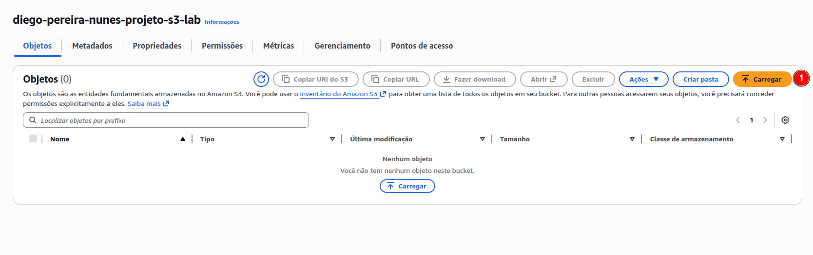

### Passo 2: Adicionar Arquivos: Você pode arrastar um arquivo do seu computador ou clicar em Adicionar arquivos. Escolha uma imagem ou um arquivo de texto simples para testar.
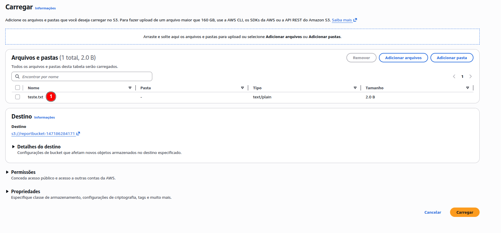
Entendendo os Metadados: Antes de clicar em finalizar, role a página até a seção Propriedades.
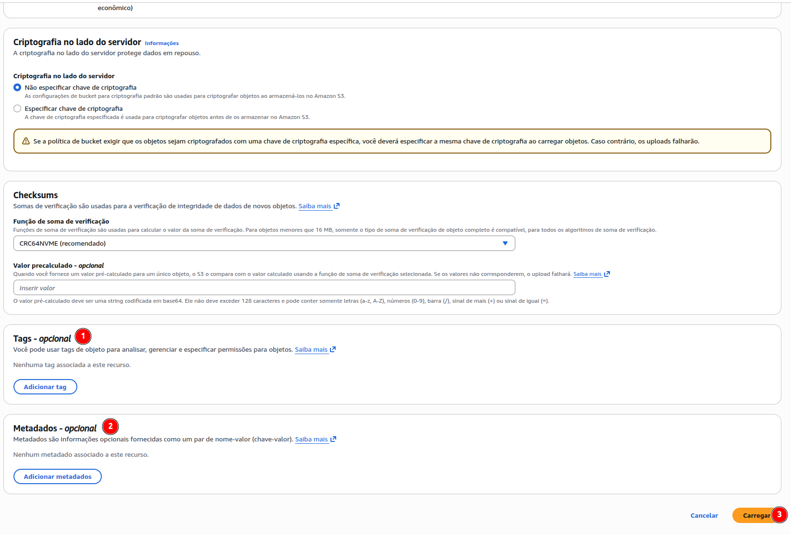
Aqui você verá o "Tipo de conteúdo" (Content-Type), como image/jpeg ou text/plain. A AWS identifica isso automaticamente para que o navegador saiba como abrir o arquivo depois.

### Passo 3: Finalizar: Clique no botão Upload no final da página.

Cenário de Aplicação e Realidade Empresarial 🏢
Imagine uma empresa de Streaming de Vídeo. Quando o editor sobe um vídeo bruto, ele adiciona metadados personalizados como projeto: serie-x, episodio: 01 e status: revisado.

Pilar de Eficiência de Performance: Usar metadados permite que outros sistemas automatizados da empresa localizem e processem esses vídeos sem precisar abrir o arquivo para saber o que tem dentro.

### 3. Segurança e Permissões: Configurar quem pode ver o quê 🔐
O que é a funcionalidade?
A segurança no S3 funciona como uma "camada dupla" de proteção:
 - IAM (Identity and Access Management): Define QUEM pode acessar (ex: "O usuário João pode ler arquivos"). É focado na pessoa ou no serviço.
 - Bucket Policy (Política de Bucket): Define O QUE pode ser feito com o bucket (ex: "Este bucket só aceita conexões seguras HTTPS"). É focado no recurso (o balde).

Cenário de Aplicação
Imagine que você tem um bucket com currículos de candidatos. Você usa o IAM para dar acesso apenas ao time de RH e usa a Bucket Policy para garantir que ninguém de fora da rede da empresa consiga abrir esses arquivos, mesmo que tenha uma senha.

### Passo 1: Acesse as Permissões
Dentro do seu bucket, clique na aba Permissões (Permissions).
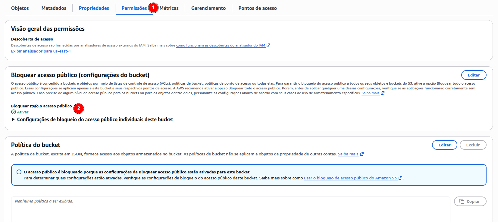

### Passo 2: Bloqueio de Acesso Público
Verifique se o "Bloqueio de acesso público" está ativado (On). Pilar de Segurança: Mantenha isso ativado a menos que o bucket seja para um site estático público.

### Passo 3: Editar Política do Bucket
Role até "Política de bucket" e clique em Editar.
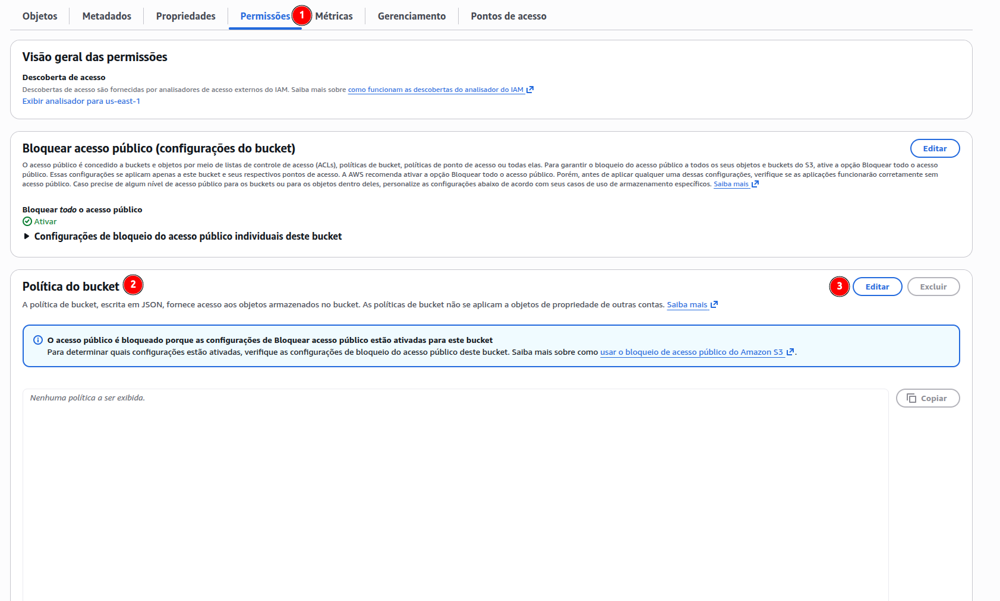
Aplicar uma Política (Exemplo de leitura pública para um arquivo específico):
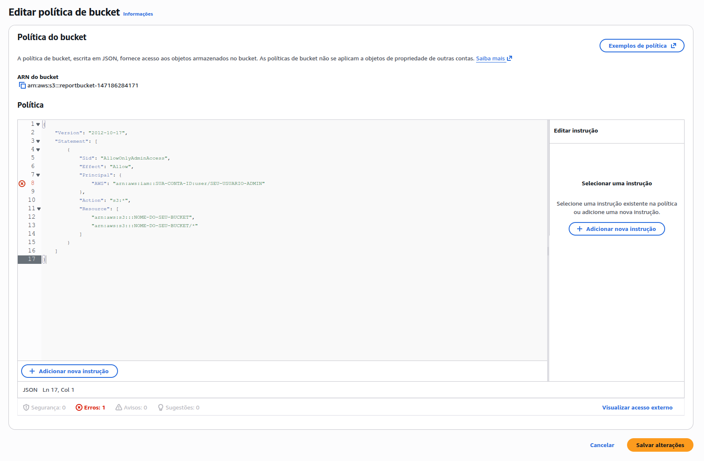

Exemplo do código:
{
    "Version": "2012-10-17",
    "Statement": [
        {
            "Sid": "AllowOnlyAdminAccess",
            "Effect": "Allow",
            "Principal": {
                "AWS": "arn:aws:iam::SUA-CONTA-ID:user/SEU-USUARIO-ADMIN"
            },
            "Action": "s3:*",
            "Resource": [
                "arn:aws:s3:::NOME-DO-SEU-BUCKET",
                "arn:aws:s3:::NOME-DO-SEU-BUCKET/*"
            ]
        }
    ]
}

Salvar alterações: Clique em Salvar alterações.

Exemplo de Cenário Real nas Empresas 🏢
O Nubank ou o Inter utilizam políticas de bucket extremamente rígidas para armazenar comprovantes de transações. Eles aplicam políticas que impedem que qualquer arquivo seja apagado por um período X (Object Lock) e garantem que apenas os servidores internos de processamento de extratos (via perfis de IAM) consigam ler esses dados.

Resultado Esperado ✅
Ao concluir, você terá um controle refinado. Você será capaz de tentar acessar o link do arquivo e ver que o acesso é negado, a menos que você tenha explicitamente permitido através da política ou que esteja logado com um usuário que tenha permissão no IAM.

Pergunta de Tutor para os alunos: 🎓
"Se eu te der um usuário de IAM com 'Acesso Total ao S3', mas na Bucket Policy estiver escrito explicitamente que 'Ninguém pode deletar arquivos', o que você acha que acontece se esse usuário tentar deletar algo? O 'Sim' do IAM vence o 'Não' da Bucket Policy?"

### 4. Versionamento: Proteger seus dados contra exclusões acidentais ⏳
O que é a funcionalidade?
O versionamento permite manter várias variantes de um objeto no mesmo bucket. Quando ativado, se você subir um arquivo com o mesmo nome de um já existente, a AWS não sobrescreve o antigo; ela cria uma "nova versão" e guarda a anterior. Se você deletar um arquivo, a AWS apenas coloca um "marcador de exclusão" por cima dele, permitindo que você o recupere facilmente.

Cenário de Aplicação 🏗️
Imagine que um estagiário ou um script automatizado com erro acabe deletando toda a pasta de documentos fiscais da empresa. Sem o versionamento, esses dados estariam perdidos (a menos que houvesse um backup externo). Com o versionamento, você simplesmente remove os marcadores de exclusão e os arquivos reaparecem instantaneamente.

### Passo 1: Acesse as Propriedades
Dentro do seu bucket, clique na aba Propriedades (Properties).
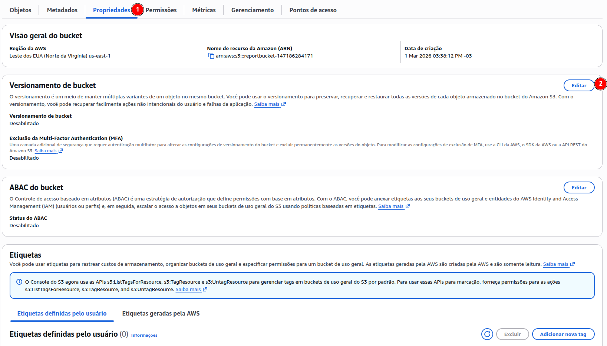

### Passo 2: Versionamento de bucket
Clique em Editar na seção "Versionamento de bucket". Ativar: Selecione Ativar (Enable) e clique em Salvar alterações.
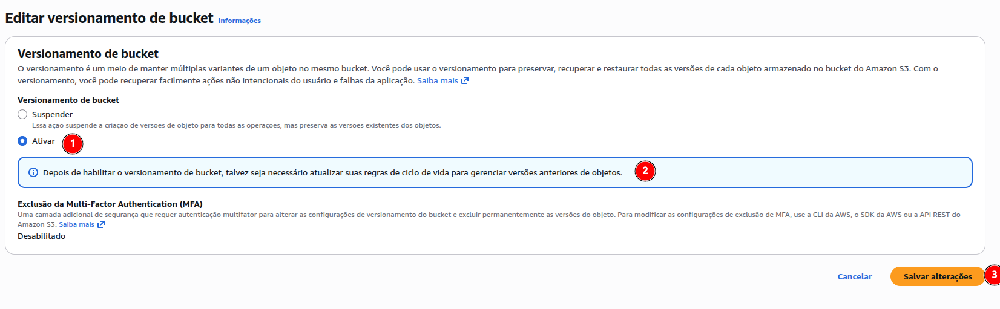
Teste a "Mágica": * Faça o upload de um arquivo chamado teste.txt com o texto "Versão 1".
Faça o upload do mesmo arquivo teste.txt, mas altere o texto para "Versão 2".
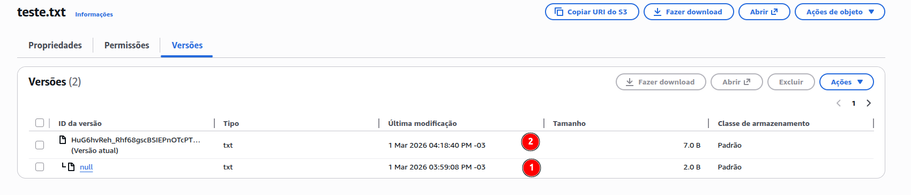
Clique no arquivo e depois no botão Mostrar versões (Show versions). Você verá ambos listados com IDs de versão diferentes!

Exemplo de Cenário Real nas Empresas 🏢
Empresas de Desenvolvimento de Software que armazenam artefatos de compilação ou arquivos de configuração no S3 utilizam o versionamento para garantir que possam fazer um "rollback" (voltar atrás) imediato caso uma nova versão de um arquivo cause erro no sistema.

Resultado Esperado ✅
Você terá a segurança de que nenhum dado será permanentemente perdido por erro humano ou falha de aplicação. No console, você conseguirá alternar a visualização para ver o histórico completo de modificações de qualquer objeto.

Pergunta de Tutor para os alunos: 🎓
"O versionamento é fantástico para segurança, mas lembre-se: a AWS cobra pelo armazenamento de todas as versões. Se você tem um arquivo de 1GB e faz 10 alterações nele, você terá 10GB ocupados. Pensando no pilar de Otimização de Custos, qual recurso poderíamos usar para apagar versões antigas automaticamente após 30 dias?"

(Dica: A resposta está no nosso próximo e último tópico!)

### 5. Gerenciamento de Ciclo de Vida: Eficiência Financeira e Operacional 💰
O que é a funcionalidade?
As Regras de Ciclo de Vida (Lifecycle Rules) permitem que você defina ações automáticas para os seus objetos com base na idade deles. Em vez de pagar caro por arquivos que ninguém acessa há meses, a AWS move esses arquivos para classes de armazenamento mais baratas (como o Glacier) ou os exclui permanentemente de forma automática.

Cenário de Aplicação 🏗️
Imagine que sua aplicação gera logs diários. Esses logs são muito importantes nos primeiros 30 dias para auditoria. Após isso, a chance de alguém precisar deles é mínima, mas por questões legais, você precisa guardá-los por 90 dias no Glacier antes de descartar.

### Passo 1: Acesse o Gerenciamento
Dentro do seu bucket, clique na aba Gerenciamento (Management).
Criar regra de ciclo de vida: Clique no botão Criar regra de ciclo de vida.
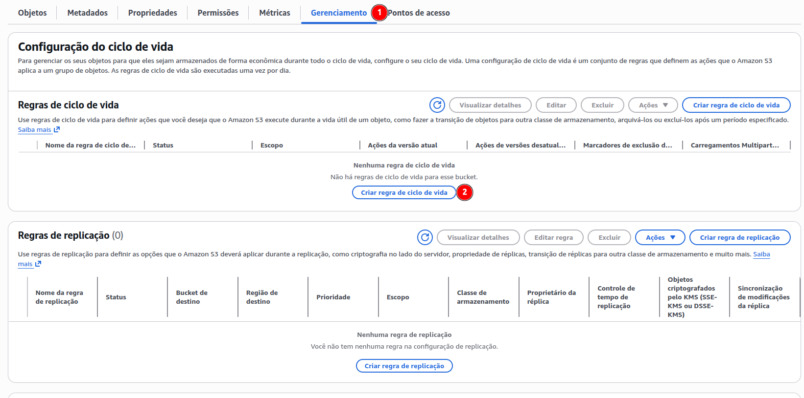

### Passo 2: Criando política de ciclo de vida
Nome e Escopo: * Dê um nome à regra (ex: Arquivar-e-Deletar-Logs).
Escolha Aplicar a todos os objetos no bucket.
Ações da Regra: Selecione as opções: 
Transição de versões desatualizadas de objetos entre classes de armazenamento.
Excluir permanentemente versões desatualizadas de objetos.
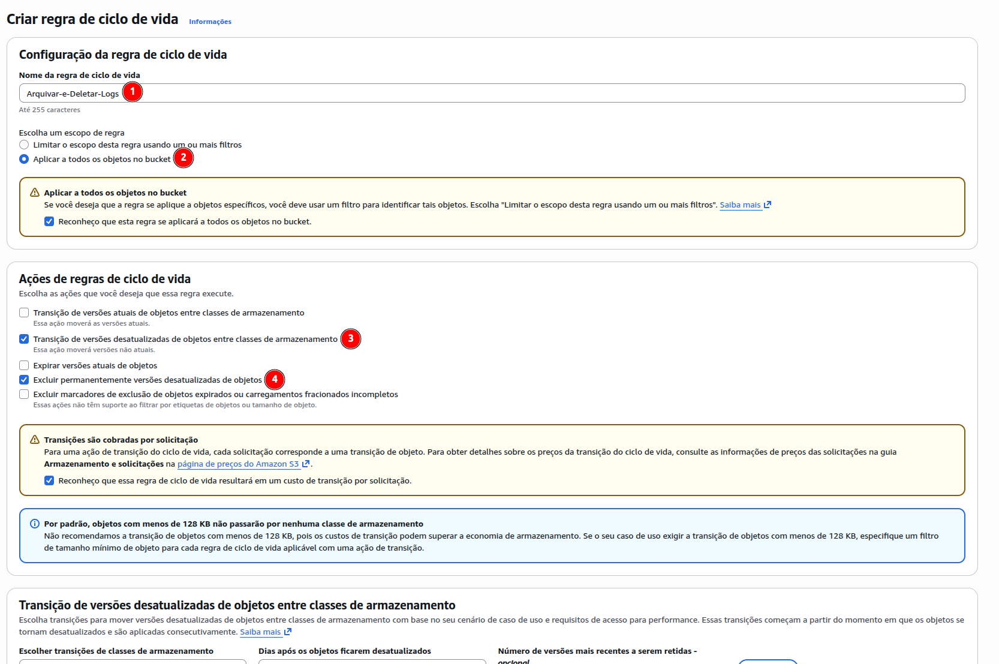

Transição de versões desatualizadas de objetos entre classes de armazenamento:
Transição de versões desatualizadas de objetos entre classes de armazenamento: Configure para mover para S3 Glacier Flexible Retrieval após 30 dias da criação.
Excluir permanentemente versões desatualizadas de objetos: Configure para 90 dias. Após esse período, o arquivo será deletado automaticamente.
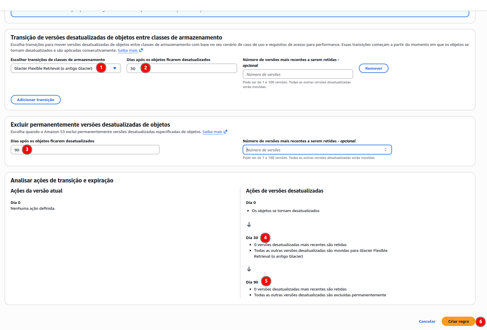
Revisar e Criar: Clique em Criar regra.

Exemplo de Cenário Real nas Empresas 🏢
Empresas de Segurança Patrimonial que armazenam filmagens de câmeras no S3 utilizam isso rigorosamente. As imagens da última semana ficam no "S3 Standard" (acesso rápido). Imagens com mais de 7 dias vão para o "S3 Intelligent-Tiering" ou "Archive", e após o período de retenção legal (ex: 90 dias), são apagadas para não gerar custos infinitos de armazenamento.

Resultado Esperado ✅
O bucket agora é inteligente e "autolimpante". Você garantiu eficiência operacional (ninguém precisa apagar arquivos manualmente) e financeira (o custo de armazenamento cairá drasticamente após os primeiros 30 dias com a movimentação para o Glacier).

Pergunta de Finalização para os alunos: 🎓
"Se ativamos o Versionamento no passo anterior e agora configuramos a Expiração de 90 dias, o que acontece com as 'Versões Antigas' que não são a atual? Elas também precisam de uma regra de ciclo de vida específica ou a regra de expiração de objetos atuais já limpa tudo?"

(Dica de Tutor: No Lifecycle, existem configurações separadas para 'Versões atuais' e 'Versões não atuais'. Para economizar de verdade, precisamos configurar ambas!)

## 🏆 Desafio Final: Operação Resiliência e Economia

O Cenário
Você foi contratado como consultor de Cloud para a empresa "LogSecure Corp". A empresa lida com auditorias financeiras e possui uma regra rígida:

"Todos os relatórios de auditoria devem ser armazenados com segurança máxima. Eles precisam ser guardados por um histórico de versões caso alguém os altere por erro. Após 60 dias, os relatórios raramente são acessados e devem custar o menor valor possível. Após 120 dias, por questões de conformidade, eles devem ser apagados definitivamente, mantendo apenas a versão atual."

Sua Missão
Configure uma solução no Amazon S3 que atenda aos seguintes requisitos técnicos:

Estrutura de Armazenamento:
Crie um bucket seguindo o padrão de nomenclatura: logsecure-auditoria-[seu-nome]-[data].
Suba um arquivo chamado relatorio_final.pdf (pode ser qualquer PDF ou arquivo de texto).

Segurança e Proteção:
Ative o Versionamento para garantir que nenhuma alteração no relatório seja definitiva.
Configure uma Política de Bucket que permita apenas ao seu usuário (ou um usuário Admin específico) deletar objetos.

Automação de Ciclo de Vida (Lifecycle):
Crie uma regra que mova os arquivos para a classe S3 Glacier Deep Archive exatamente após 60 dias da criação.
Configure a expiração (exclusão) de objetos não atuais, após atingir o total de dias do arquivo 120 dias.

📝 Entregáveis para o Tutor
Para provar que a missão foi cumprida, o aluno deve apresentar:

O ARN do bucket criado.
O código JSON da política de bucket utilizada.
Um print da tela de versionamento.
Um print da tela de Configurações de Ciclo de Vida mostrando as regras de 60 e 120 dias.

💡 Dica do Tutor para os Alunos
"Atenção ao testar o versionamento! Se você deletar o arquivo relatorio_final.pdf com o versionamento ativo, ele vai sumir da lista principal, mas ainda estará lá escondido sob um 'Delete Marker'. O desafio é: como você faria para restaurar esse arquivo se o seu chefe pedisse agora?"
