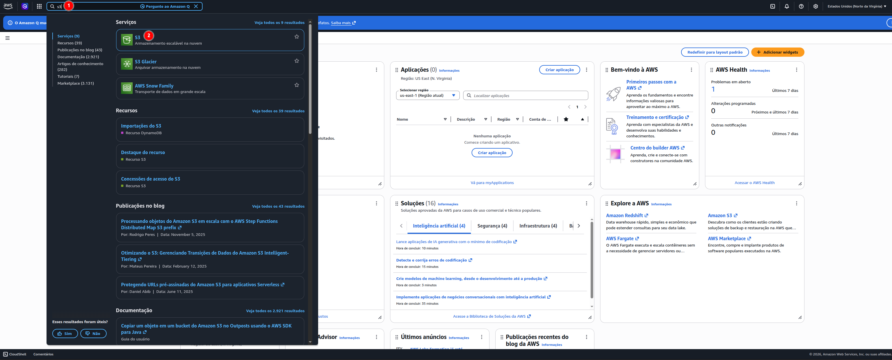
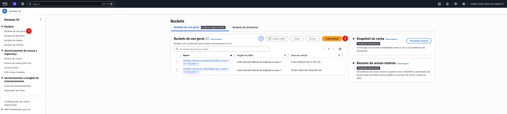
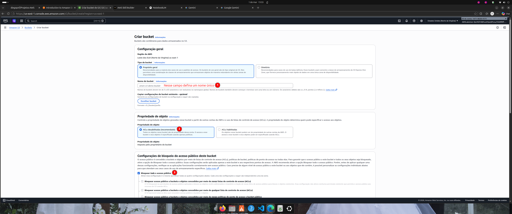
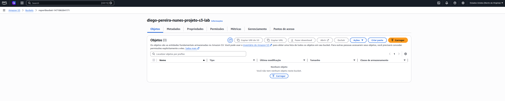

Projeto: Introdução ao Amazon Simple Storage Service (S3)

Neste projeto, vamos explorar o coração do armazenamento na AWS. O S3 não é apenas um "HD na nuvem", mas um sistema de armazenamento de objetos altamente inteligente e resiliente.

1. O que é o serviço/funcionalidade? 🛠️
O Amazon S3 (Simple Storage Service) é um serviço de armazenamento de objetos. Diferente de um sistema de arquivos tradicional (onde você tem pastas e subpastas em um disco), no S3 cada arquivo é um "objeto" armazenado em um "bucket" (balde).

Pilar de Excelência Operacional: Ele oferece durabilidade de 99,999999999% (11 noves), o que significa que seus dados estão virtualmente imunes a perdas por falhas de hardware.

2. Cenário de Aplicação 🏗️

Imagine que você está configurando a infraestrutura de uma startup. Você precisa de um local para:
    Hospedar imagens e vídeos da plataforma.
    Armazenar logs de segurança que não podem ser alterados.
    Manter backups de bancos de dados.
    Garantir que, se um arquivo for deletado por erro humano, ele possa ser recuperado (Versionamento).

3. Exemplo de Cenário Real nas Empresas 🏢
Netflix: A Netflix utiliza o Amazon S3 para armazenar os arquivos master de seus filmes e séries. Quando um novo conteúdo é carregado, ele fica no S3 e, a partir dali, é processado em diferentes formatos para serem entregues aos usuários. Eles utilizam Políticas de Bucket rigorosas para garantir que apenas os serviços internos de transcodificação acessem esses arquivos originais.

🎯 Objetivos do Laboratório
Ao final deste guia, você será capaz de:
    Criar um Bucket: Entender as regras de nomenclatura global.
    Upload de Objetos: Subir arquivos e entender os metadados.
    Segurança e Permissões: Configurar quem pode ver o quê (IAM vs Bucket Policies).
    Versionamento: Proteger seus dados contra exclusões acidentais.
    Política de ciclo de vida: Automatizar a transição de arquivos para classes de armazenamento mais baratas ou exclusão programada para reduzir custos.

🏁 Resultado Esperado
Você terá um ambiente de armazenamento seguro, onde um arquivo estará disponível conforme as regras definidas, com histórico de versões ativo e políticas de segurança que impedem o acesso público indesejado. Além disso, o bucket estará configurado para gerenciar o ciclo de vida dos dados automaticamente, garantindo eficiência financeira e operacional ao mover dados antigos para o S3 Glacier ou removê-los após o período de retenção.

🤔 Vamos começar a refletir?
Para darmos o primeiro passo na criação do bucket, precisamos pensar na Identidade. O nome de um bucket no S3 é único globalmente (nenhuma outra conta no mundo pode ter um bucket com o mesmo nome que o seu).

1. Criar um Bucket: Entender as regras de nomenclatura global 🌍
O primeiro passo no Amazon S3 é a criação de um Bucket (que podemos traduzir como "balde" ou "contêiner"). Diferente de uma pasta no seu computador, o bucket é uma entidade lógica na nuvem da AWS.

O que é importante saber: O nome que você escolher para o seu bucket deve ser único em todo o mundo. Isso acontece porque o nome faz parte da URL que será usada para acessar os arquivos (ex: https://seu-nome-de-bucket.s3.amazonaws.com).

Passo 1: Acesso e Localização do Serviço 🌐
    1- Acesse o Console de Gerenciamento da AWS: Faça login na sua conta.
    2-Localize o S3: Na barra de busca no topo, digite "S3" e selecione o serviço para abrir o painel de controle do Amazon S3.
    

Passo 2: Iniciar a Criação ➕
No painel do S3, clique no botão laranja Criar bucket (Create bucket).

Passo 3: Configurações Gerais ⚙️
Nome do bucket: Insira um nome que seja exclusivo globalmente.

Dica de Tutor: Lembre-se do padrão que discutimos (ex: nome-do-aluno-projeto-s3-lab).
Região da AWS: Escolha a região mais próxima de você ou de seus usuários (ex: us-east-1 ou sa-east-1).

Vamos fazer uma pausa estratégica aqui:
Ao avançar na tela de criação, você verá uma seção chamada "Configurações de bloqueio de acesso público". Por padrão, a AWS deixa tudo bloqueado. 🛡️
Considerando que estamos seguindo as boas práticas de segurança (Pilar de Segurança), se você precisar que um arquivo seja visto na internet, você acha que o ideal seria abrir o acesso de todo o bucket ou manter o bucket fechado e usar uma Política de Bucket específica para esse arquivo? Por que?