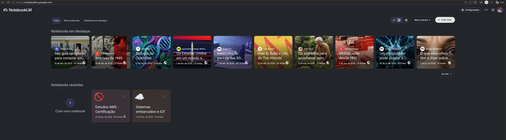
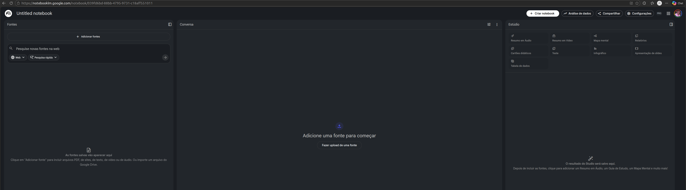
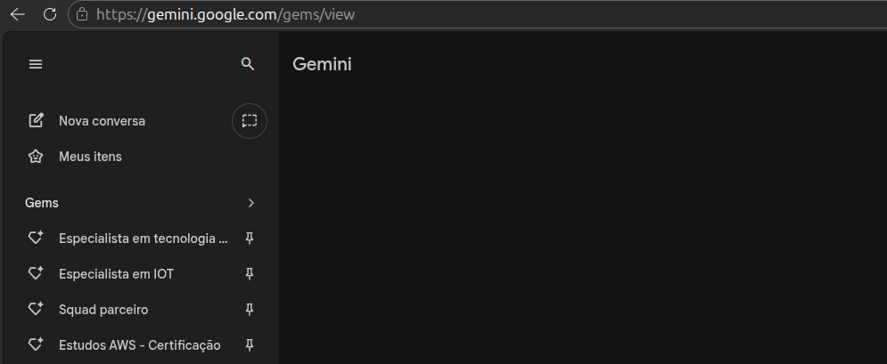
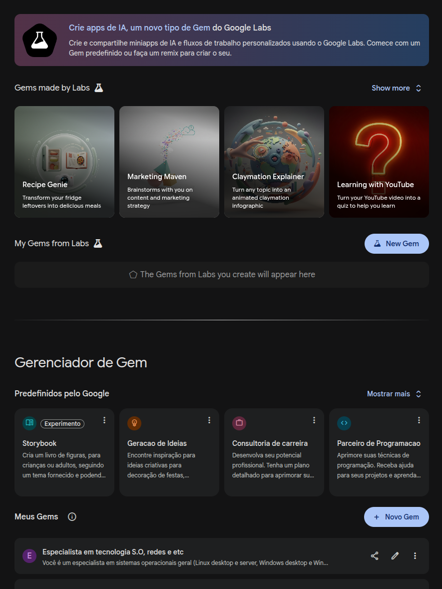
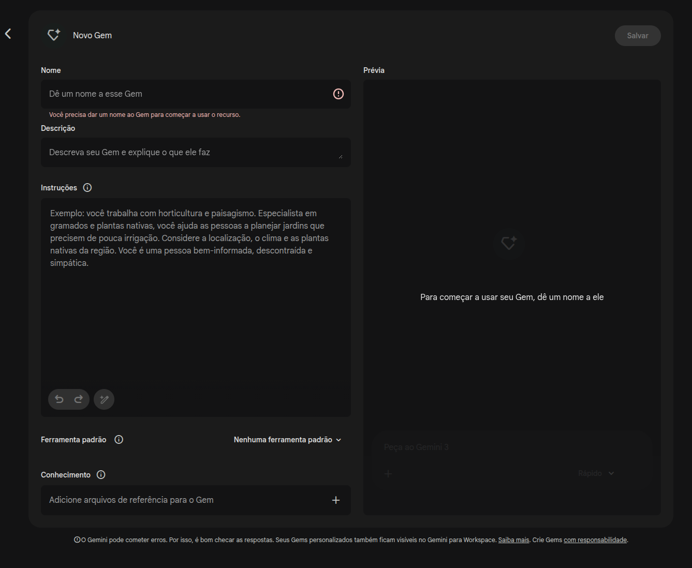
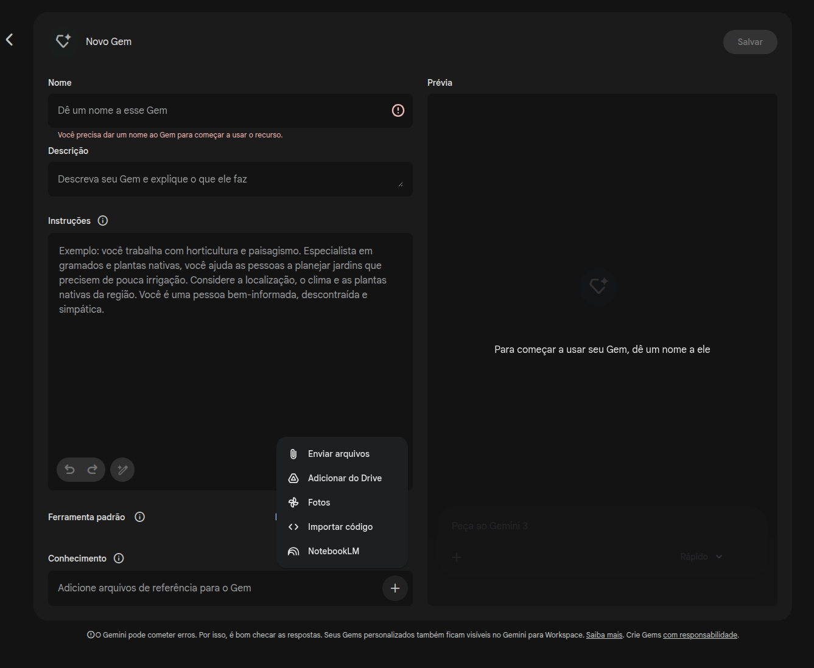

# Como usar a IA com o nosso conteúdo

O Gemini 🧠 é a inteligência artificial avançada do Google. Diferente de um sistema comum, ele consegue processar informações complexas, entender código, analisar imagens e, no nosso caso, atuar como um mentor que conhece profundamente os pilares do AWS Well-Architected Framework (Excelência Operacional, Segurança, Confiabilidade, Eficiência de Performance, Otimização de Custos e Sustentabilidade).

O NotebookLM 📓 é um caderno de notas inteligente. A grande diferença é que ele é "alimentado" por fontes específicas que você escolhe. Em vez de buscar na internet inteira, ele foca nos documentos que você carrega — como a documentação da AWS e o seu repositório do GitHub. Isso evita "alucinações" e garante que as respostas sejam baseadas exatamente no material de estudo.

## 1. 🚀 Potencializando os estudos: Como vamos trabalhar?
A integração dessas ferramentas cria um ecossistema de aprendizado poderoso:

Foco no Conteúdo Real: O NotebookLM lerá seu repositório de exercícios e a documentação geral. Quando um aluno fizer uma pergunta, a IA saberá exatamente a qual exercício do seu GitHub ele está se referindo.

Aprendizado Guiado: Eu não darei apenas a resposta pronta. Vou usar perguntas norteadoras para ajudar o aluno a pensar como um Arquiteto de Soluções. Se o desafio for sobre S3, por exemplo, posso perguntar: "Para esse cenário de alta disponibilidade, qual classe de armazenamento você acha que seria mais custo-efetiva?".

Personalização: Eu serei o tutor que conhece o histórico dos projetos. Posso comparar um exercício de EC2 que o aluno fez ontem com um novo desafio de Lambda hoje, mostrando a evolução de instâncias para Serverless.

## 2. 🛠️ Como vocês podem usar essa estrutura?

Vocês terão suporte total para diversas tarefas:

Tirar dúvidas do GitHub: Se vocês travarem em um passo de um laboratório (ex: "Não consigo conectar na minha instância EC2"), eu analisarei o contexto do exercício no repositório e ajudarei a diagnosticar problemas de Security Groups ou Key Pairs.

Dúvidas Gerais AWS: Perguntas sobre conceitos (ex: "Qual a diferença entre uma Subnet Pública e Privada?") serão respondidas com exemplos didáticos e cenários reais.

Geração de Conteúdo Multimodal:
Áudio 🎙️: O NotebookLM pode gerar "Deep Dives" em áudio, transformando a documentação densa da AWS em uma conversa dinâmica que os alunos podem ouvir no trajeto para o trabalho.
Estruturação de Apresentações (PowerPoint) 📊: Posso ajudar a estruturar os tópicos e argumentos para que o aluno crie uma apresentação técnica sobre um projeto, focando no "resultado esperado" e no "cenário real".
Cenários de Empresas Reais 🏢: Para cada projeto, trarei exemplos de como empresas como Netflix ou Airbnb utilizam aquele serviço específico para resolver problemas de escala global.

## Como criar o NotebookLM e o GEM personalizado

### Passo 1: Criando um NotebookLM
Acesse o site do NotebookLM: https://notebooklm.google.com/ e clique em criar novo notebook.

### Passo 2: Definindo nome do NotebookLM
Clicando no canto superior esquerdo em "Untitled notebook" defina um nome para ele.

### Passo 3: Acessando a tela de Gemini Personalizado (GEM)
Acesse a página do Gemini: https://gemini.google.com/app e clique em "Gems".

Desça a página até gerenciador de gem e clique em "+ Novo Gem".

### Passo 4: Criando o Gemini Personalizado (GEM)

Defina o nome, instruções para ele, como por exemplo: "Você é um profissional que utiliza a Cloud AWS, possui todas as certificações disponíveis, domina todos os pilares do framework, explica de forma técnica e detalhada, mas ao mesmo tempo, direcionando o ensinamento para uma pessoa que está entrando recente na área de Cloud. Os seus ensimanetos podem ser didáticos, mas não deve perder a essência técnica. Você deve responder as perguntas mostrando qual linha de raciocínio você usou (em etapas), qual pilar está direcionado a resolução do problema ou dúvida  e dicas em geral."

Em "ferramenta padrão" você poderá usar a opção de ensino guiado e por último, em "conhecimento" escolha a sua fonte de dados "NotebookLM" e insira o link do github do nosso projeto (importar código"): https://github.com/diegopnf/Projetos-AWS.
Dessa forma, o Gemini irá consultar o nosso notebooklm e irá conhecer o nosso projeto do GitHub para tirar dúvidas mais direcionadas.

Por último, acessando novamente o NotebookLM: https://notebooklm.google.com/, você poderá gerar aúdios, videos, apresentações, perguntas, gerar textos, a partir desses arquivos do projeto do github ou outros arquivos que você subir no seu notebookLM.

Link do meu NotebookLM de exemplo: https://notebooklm.google.com/notebook/039fd6bd-88bb-4795-9731-c18aff551011